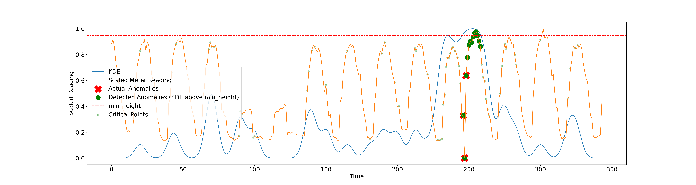

# Energy-Time-series-anomaly-detection


## Steps
1. Set up the appropriate configuration in config.json
2. Run - run.py (It runs 3 scripts and create reconstruction data pickle files)
3. Run - anom_detect_gan.py  (It also has bayes opt to tune the params)
4. Run - plotting.py to create plots for the anomaly detection

## Configs

Give below is the config file with default values.

```yaml
{"data": {"dataset_path": "dataset/15_builds_dataset.csv", "train_path": "model_input/", "only_building": 1304}, "training": {"batch_size": 128, "num_epochs": 200, "latent_dim": 100, "w_gan_training": true, "n_critic": 5, "clip_value": 0.01, "betaG": 0.5, "betaD": 0.5, "lrG": 0.0002, "lrD": 0.0002}, "preprocessing": {"normalize": true, "plot_segments": true, "store_segments": true, "window_size": 48}, "recon": {"use_dtw": true, "iters": 1000, "use_eval_mode": true}}```
```

## Comments

Our related paper "Generative Adversarial Network with Soft-Dynamic Time Warping and Parallel Reconstruction for Energy Time Series Anomaly Detection" (https://doi.org/10.48550/arXiv.2402.14384) got accepted at the AI4TS Workshop @ AAAI 24. 

**Note :** A journal extension of the paper is under development. The repository will be frequently updated. 

The directory "experimental" contains code for comparisons with other popular Gan based methods. We perform anomaly detection using different methodologies and also try to maintain similar evaluation and training hyper-parameters for fair comparisons.


## Useful Resources

[1] 1D-DCGAN : https://github.com/LixiangHan/GANs-for-1D-Signal

[2] soft-dtw loss cuda : https://github.com/Maghoumi/pytorch-softdtw-cuda

[3] TAnoGAN : https://github.com/mdabashar/TAnoGAN

[4] MADGAN : https://github.com/Guillem96/madgan-pytorch

[5] TADGAN : https://github.com/arunppsg/TadGAN

[6] LEAD Dataset : https://github.com/samy101/lead-dataset

[7] DEGAN : https://arxiv.org/pdf/2210.02449.pdf

