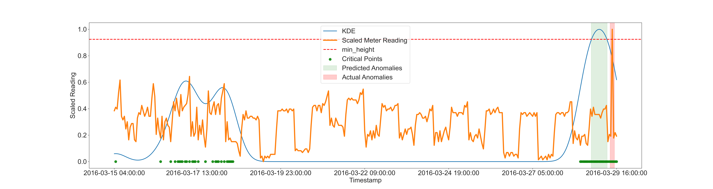
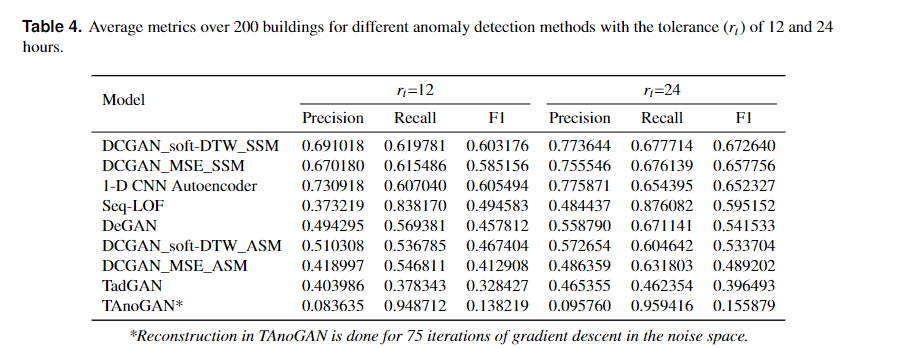

# Energy-Time-series-anomaly-detection

Our related paper "Generative Adversarial Network with Soft-Dynamic Time Warping and Parallel Reconstruction for Energy Time Series Anomaly Detection" (https://doi.org/10.48550/arXiv.2402.14384) got accepted at the AI4TS Workshop @ AAAI 24. 

**Note:** A journal extension of the paper is under development. The repository will be frequently updated.



[View Poster PDF](poster.pdf)

## LEAD Dataset

This study uses the LEAD 1.0 dataset. This public dataset includes hourly-based electricity meter readings for commercial buildings over up to one year. The dataset consists of year-long hourly electricity meter readings with anomaly annotations from 200 buildings and is open-sourced in this GitHub repository [6]. Each building contains about 8,747 data points. Anomaly annotations are provided, marking anomalous points (timestamps) within each building's time series.

This dataset contains hourly electricity meter readings and anomaly annotations for various commercial buildings over a period of up to one year. The data is structured as follows:

- `building_id`: Unique identifier for each building.
- `timestamp`: Hourly timestamp of the meter reading.
- `meter_reading`: Actual electricity meter reading value.
- `anomaly`: Binary indicator of whether the timestamp (reading) is considered anomalous (1) or not (0).

The dataset covers readings from 200 buildings, with each building having approximately 8,747 data points. Anomaly annotations are provided to mark specific timestamps within each building's time series where anomalous readings were detected.

Here's a small example of the dataset:

| building_id | timestamp       | meter_reading | anomaly |
|-------------|-----------------|---------------|---------|
| 1           | 01-01-2016 00:00| 100.5         | 0       |
| 1           | 01-01-2016 01:00| 98.2          | 0       |
| 1           | 01-01-2016 02:00| 95.7          | 0       |
| 2           | 01-01-2016 00:00| 200.1         | 0       |
| 2           | 01-01-2016 01:00| 203.4         | 1       |
| 2           | 01-01-2016 02:00| 197.8         | 0       |


## Getting started 

1. Clone the repository:
  ```bash
  git clone https://github.com/HardikPrabhu/Energy-Time-Series-Anomaly-Detection.git
  ```
2. Navigate to the cloned repository.
3. Install the required python packages using pip:

  * First install torch with cuda support.
  ```bash
  pip install torch==2.1.0 torchvision==0.16.0 torchaudio==2.1.0 --index-url https://download.pytorch.org/whl/cu121
  ```
  * Then install other requirements.
  ```bash
  pip install -r requirements.txt
  ```

4. Adjust the experiment settings:

  Modify the config.json file to configure the experiment according to your requirements. This [JSON config file](config.json) allows you to customize various parameters and settings for your experiments.

## Config JSON File Details

Given below is the config file with default values.

```yaml
{
    "data": {
        "dataset_path": "dataset/15_builds_dataset.csv",
        "train_path": "model_input/",
        "only_building": 1304
    },
    "training": {
        "batch_size": 128,
        "num_epochs": 200,
        "latent_dim": 100,
        "w_gan_training": true,
        "n_critic": 5,
        "clip_value": 0.01,
        "betaG": 0.5,
        "betaD": 0.5,
        "lrG": 0.0002,
        "lrD": 0.0002
    },
    "preprocessing": {
        "normalize": true,
        "plot_segments": true,
        "store_segments": true,
        "window_size": 48
    },
    "recon": {
        "use_dtw": true,
        "iters": 1000,
        "use_eval_mode": true
    }
}
```


### Data Section
- `dataset_path`: Path to the dataset file (`"dataset/15_builds_dataset.csv"`)
- `train_path`: Path where the training data or model inputs are stored (`"model_input/"`)
- `only_building`: Particular building identifier or index (`1304`)

### Training Section
- `batch_size`: Number of samples per batch during the training process (`128`)
- `num_epochs`: Number of training epochs (`200`)
- `latent_dim`: Dimensionality of the latent space in the model (`100`)
- `w_gan_training`: Indicates whether to use Wasserstein GAN (WGAN) training (`true`)
- `n_critic`: Number of critic (discriminator) iterations per generator iteration in WGAN training (`5`)
- `clip_value`: Clipping value for the critic's weights in WGAN training (`0.01`)
- `betaG` and `betaD`: Beta values for the generator and discriminator, respectively (`0.5`)
- `lrG` and `lrD`: Learning rates for the generator and discriminator, respectively (`0.0002`)

### Preprocessing Section
- `normalize`: Indicates whether to normalize the sements (transform all the readings in a segment to be in the [-1,1] range). (`true`)
- `plot_segments`: Specifies whether to plot the segments (`true`)
- `store_segments`: Indicates whether to store the segments (`true`)
- `window_size`: Size of the window for data preprocessing (`48`)

### Reconstruction (recon) Section
- `use_dtw`: Indicates whether to use Soft-Dynamic Time Warping (Soft-DTW) for reconstruction (`true`)
- `iters`: Number of iterations  used by the gradient descent algorithm in noise space for rconstruction (`1000`)
- `use_eval_mode`: Indicates whether to use evaluation mode of the Generator is used during reconstruction (`true`)


## Anomaly detection on a single building

### Building Selection and Preprocessing

* Insert the building id of the desired building in the config file.

​```python
config["data"]["only_building"] = 1304
​```

* Adjust the preprocessing settings in the config file. For example, change the `window_size` of the subsequences.

* Run the `preprocessing.py` Python script. It will divide the building data into segments. The training segments would not contain any anomaly. 
The model input tensors of the training segments will be created in the `model_input` directory.

### Training the GAN Model

* First, adjust the training settings in the config file. The GAN model can be trained in two modes:
 - WGAN training
 - Simple training (vanilla)

* Set the `w_gan_training` option to `False` for simple training and `True` for WGAN training.

​```python
config["training"]["w_gan_training"] = True
​```

* After adjusting the training settings in the config file, run the `training.py` script. It will create the model files in the `trained_out` directory.
* Both the generator and the discriminator are stored separately. Only the generator would be used for reconstruction.

### Reconstruction of the Test Subsequences

* Adjust the reconstruction settings in the config file.
* Two options are provided as reconstruction losses:
  * Soft-DTW
  * MSE

* Set the `use_dtw` option to `False` for MSE and `True` for soft-DTW loss.

​```python
config["recon"]["use_dtw"] = True
​```

* Run the `testing.py` script. It will create the reconstruction data pickle files in the `test_out` directory. 

### Anomaly Detection 

* Only the reconstruction data pickle file is required for the final step. 
* Run the `anom_detect_gan.py` script.
* Note: Uncomment Line 105 and pass the list of specific buildings to be evaluated, else all the available buildings will be evaluated. 
* Bayesian optimization is used to adjust the evaluation hyper-parameters.
* A results CSV is created in the working directory.

## Anomaly Detection on the Entire Dataset

Anomaly detection process for the entire set of 200 buildings follow the same steps. Each building gets its own GAN model. The process is automated by the `run.py` script where the reconstruction pickle files are obtained for each building by running the `preprocessing.py`, `training.py` and `testing.py` scripts on loop.

1. Set up the appropriate configuration in `config.json`
2. Run `run.py` (It runs 3 scripts and creates reconstruction data pickle files)
3. Run `anom_detect_gan.py` 
4. Run `plotting.py` to create plots for the anomaly detection


## Baseline Methodologies


The directory "experimental" contains code for comparisons with other popular methods. We perform anomaly detection using different methodologies and also try to maintain similar evaluation and training hyper-parameters for fair comparisons.

It includes the following implementations:

* TAnoGAN - Use gradient descent in the noise space, to get appropriate noise for reconstruction.

* TADGAN - Train an encoder with cycle consistency, in order to map back to the noise space for reconstruction. 

* 1-D CNN Autoencoder - Use the reconstruction error obtained by encoding-decoding as anomaly score.

* DEGAN - Use the output of the discriminator (1- D(x)) directly as a score. 

* seq-LOF: Local outlier factor method by considering the subsequences as single datapoints of window size dimensions followed by our methodology to convert 
critical subsequences to anomalous timestamps.

## Benchmarking Results

Our model with different configurations and other baseline models are tested on a large dataset of 200 buildings. The average metrics are shown in the table below.



### Configurations for our models

1. DCGAN-soft-DTW_SSM:

```yaml
{
    "data": {
        "dataset_path": "dataset/200_buildings_dataset.csv",
        "train_path": "model_input/",
        "only_building": 1304
    },
    "training": {
        "batch_size": 128,
        "num_epochs": 200,
        "latent_dim": 100,
        "w_gan_training": true,
        "n_critic": 5,
        "clip_value": 0.01,
        "betaG": 0.5,
        "betaD": 0.5,
        "lrG": 0.0002,
        "lrD": 0.0002
    },
    "preprocessing": {
        "normalize": true,
        "plot_segments": true,
        "store_segments": true,
        "window_size": 48
    },
    "recon": {
        "use_dtw": true,
        "iters": 1000,
        "use_eval_mode": true
    }
}
```

2. DCGAN_MSE_SSM:

```yaml
{
    "data": {
        "dataset_path": "dataset/200_buildings_dataset.csv",
        "train_path": "model_input/",
        "only_building": 1304
    },
    "training": {
        "batch_size": 128,
        "num_epochs": 200,
        "latent_dim": 100,
        "w_gan_training": true,
        "n_critic": 5,
        "clip_value": 0.01,
        "betaG": 0.5,
        "betaD": 0.5,
        "lrG": 0.0002,
        "lrD": 0.0002
    },
    "preprocessing": {
        "normalize": true,
        "plot_segments": true,
        "store_segments": true,
        "window_size": 48
    },
    "recon": {
        "use_dtw": false,
        "iters": 1000,
        "use_eval_mode": true
    }
}
```

3. DCGAN-soft-DTW_ASM:

```yaml
{
    "data": {
        "dataset_path": "dataset/200_buildings_dataset.csv",
        "train_path": "model_input/",
        "only_building": 1304
    },
    "training": {
        "batch_size": 128,
        "num_epochs": 200,
        "latent_dim": 100,
        "w_gan_training": true,
        "n_critic": 5,
        "clip_value": 0.01,
        "betaG": 0.5,
        "betaD": 0.5,
        "lrG": 0.0002,
        "lrD": 0.0002
    },
    "preprocessing": {
        "normalize": true,
        "plot_segments": true,
        "store_segments": true,
        "window_size": 48
    },
    "recon": {
        "use_dtw": true,
        "iters": 1000,
        "use_eval_mode": false
    }
}
```

4. DCGAN-MSE_ASM:

```yaml
{
    "data": {
        "dataset_path": "dataset/200_buildings_dataset.csv",
        "train_path": "model_input/",
        "only_building": 1304
    },
    "training": {
        "batch_size": 128,
        "num_epochs": 200,
        "latent_dim": 100,
        "w_gan_training": true,
        "n_critic": 5,
        "clip_value": 0.01,
        "betaG": 0.5,
        "betaD": 0.5,
        "lrG": 0.0002,
        "lrD": 0.0002
    },
    "preprocessing": {
        "normalize": true,
        "plot_segments": true,
        "store_segments": true,
        "window_size": 48
    },
    "recon": {
        "use_dtw": false,
        "iters": 1000,
        "use_eval_mode": false
    }
}
```


## Useful Resources

[1] 1D-DCGAN : https://github.com/LixiangHan/GANs-for-1D-Signal

[2] soft-dtw loss cuda : https://github.com/Maghoumi/pytorch-softdtw-cuda

[3] TAnoGAN : https://github.com/mdabashar/TAnoGAN

[4] MADGAN : https://github.com/Guillem96/madgan-pytorch

[5] TADGAN : https://github.com/arunppsg/TadGAN

[6] LEAD Dataset : https://github.com/samy101/lead-dataset

[7] DEGAN : https://arxiv.org/pdf/2210.02449.pdf

